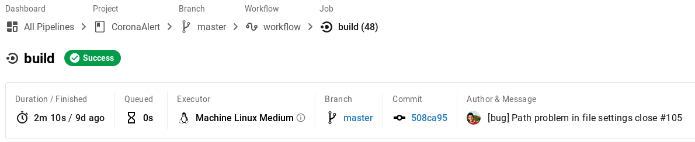
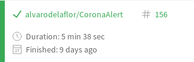
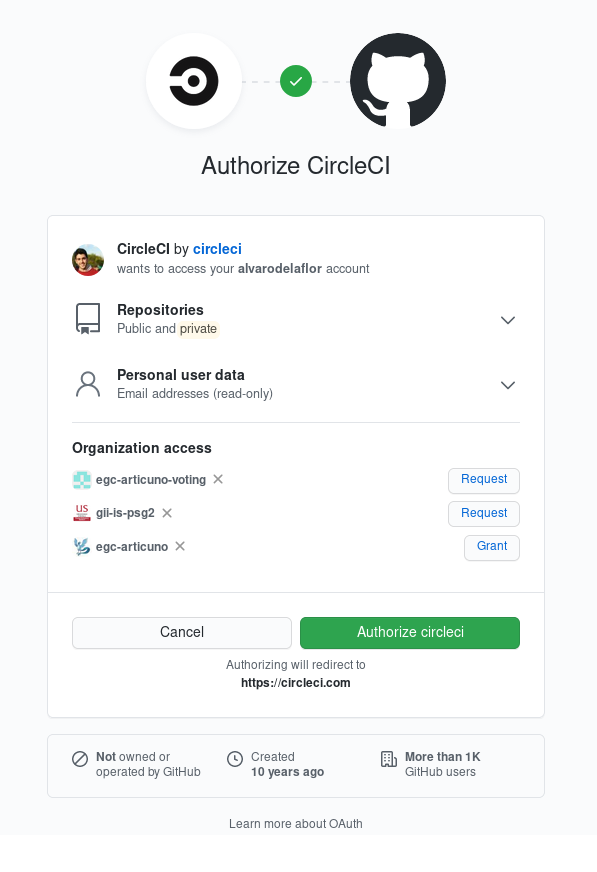
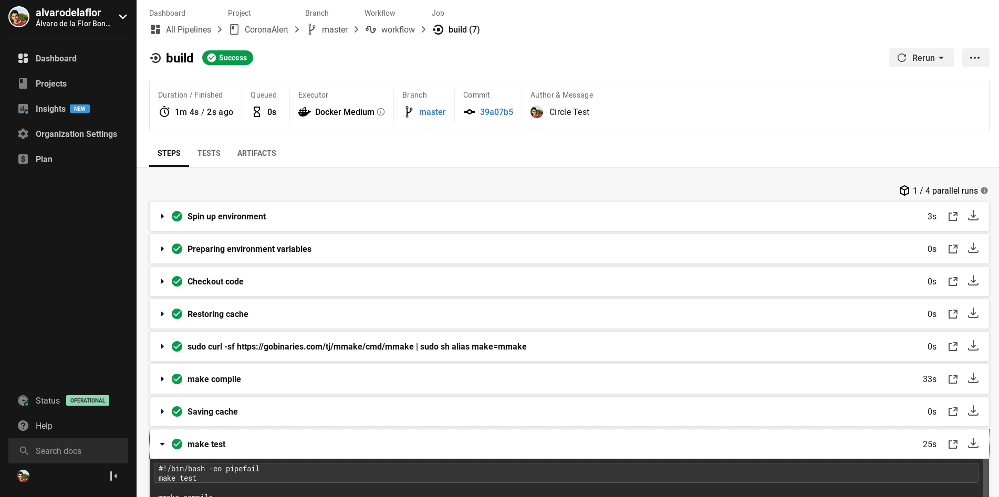

## **Continuous integration alternative**

### **Justification**

By default, for this project we will use the main continuous integration tool [Travis](https://www.travis-ci.com/). However, we consider it very interesting to provide our project with an alternative configuration that is just as valid as the previous one.

In our case, **[CircleCI](https://circleci.com/)** has been chosen as an additional tool for continuous integration.

First of all, *CircleCI* is fully integrated with *GitHub*, which is the main platform of our project. *CircleCI* will allow us to automatically run tests on the changes made to our project every time we launch a commit. Additionally, it is interesting that the status of the last compilation is shown.

Another reason why we are going to use *CircleCI* is because of its free plan. Specifically it includes 2500 free credits. In this [link](https://circleci.com/pricing/#compute-options-table) you can check how the cost of these credits is calculated. Later we will detail it more but in principle the main idea is to use *CircleCI* to take advantage of our *Docker* container. In general, according to the above link table at most our project will need the *Medium - Docker (linux)* plan which means we will have a spend of **10 credits per minute used**.

As you can see in the image above using the configuration we discussed above (*Medium - Docker (linux)*) the time it takes to perform the build is 2 minutes and 10 seconds.

Regarding the latter we would like to point out that we were very surprised by the speed of *CircleCI* when used in conjunction with Docker. As you can see in the image above for the same test set *Travis* has taken a total of 5 minutes and 38 seconds, more than 3 minutes compared to *CircleCI*.

Continuing with the above, if we approximate it to 3 minutes it would mean that each build of a build of our project would cost 30 credits. The free plan offers as we said before 2500 cŕcredits renewable every week, which means that we could perform (assuming 3 minutes the worst time) about **83 builds a week**.

We have studied the flow of our project and at no time has that number of builds in a week been exceeded. So with respect to this section this platform fully meets our requirements.

Another reason why we are going to use *CircleCI*, as previously mentioned, is its compatibility with Docker. One of our goals will be the reuse of the generated Docker containers. *CircleCI* will allow us to do it natively and as we have seen without exceeding the cost of its free plan.

### **Configuration**

1. We have to register on their website and give them access to our repositories.

2. Once registered, we will have to register our repository.

3. It proposes a file that configures itself if it is able to detect the language we are using. You can see it in this [link](.circleci/config.yml).

4. As we already anticipated in the previous step, we will simply have to create a folder with the name *.circle* and create here our circle configuration file [config.yml](../.circleci/config.yml).

5. Push and automatically circle is able to detect the changes, we only have to check that the tests have been performed and the build has been created.

As in the case of Travis, we can add a badge to our repository.

As **for the more detailed configuration of *CircleCI***, because we are going to use it in conjunction with the use of our *Docker* container **we are going to see it in much more detail in its specific section**, which you can access through this [link](docker_ci.md).