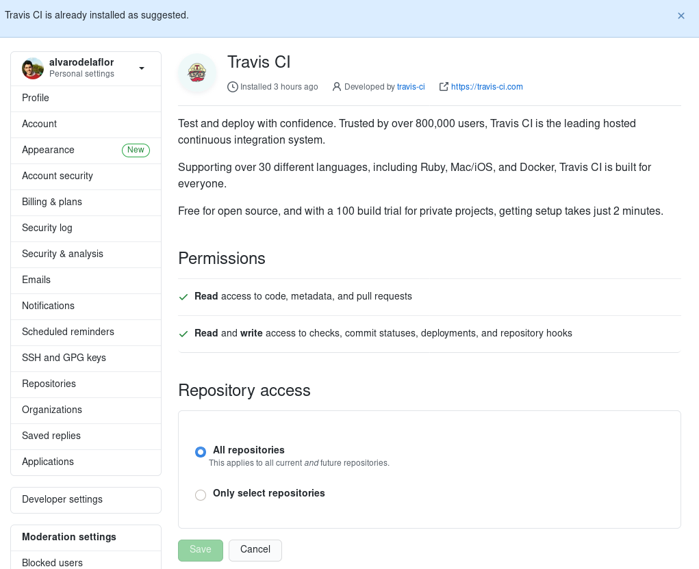

## **Travis - Continuous integration**

We will use Travis as the main tool for continuous integration. Later, in another section, we will justify the choice of an alternative platform.

In this section we will explain how we have added Travis to our project and the justification of its configuration.

### **Add Travis to the repo**

First we will start by explaining how to do the initial configuration to add Travis to our project.

1. We have to go to the [Travis CI portal](https://travis-ci.com/) and register. We recommend that you use the GitHub account to get started, as it will be much easier to associate our project.

2. The next step is to give Travis permissions to access our repository. This is very easy and can be done from the GUI.

3. The next step is to configure our *.travis.yml* file which is available in this [link](../.travis.yml).

In addition, the badge provided by Travis is used to identify the current *build* status.

### **Configure Travis to our proyect**

First of all, the configuration we have used is based on this file:

    language: scala

    scala:
    - 2.13.3
    - 2.12.13

    before_install:
    - curl -sf https://gobinaries.com/tj/mmake/cmd/mmake | sudo sh
    - alias make=mmake

    script:
    - make test

    after_success:
    - echo 'Done!'

The first thing to tell *Travis* is the language to be used. As we have verified in this [link](https://docs.travis-ci.com/user/languages/scala/), *Travis* provides official support for *Scala* providing information of how to work with it. First of all we will have to indicate it in the following way:

    language: scala

Next we will have to indicate the versions of *Scala* in which we want the tests of our project to be carried out. For it, immediately after choosing the language we will have to indicate it this way:

    scala:
    - 2.13.4
    - 2.12.13

As you can see, in our case we have chosen versions *2.13.4* and *2.12.13*.

We have decided to use version *2.12.13* because we have verified that it is the first version compatible with our chosen configuration for the test execution of our project, and it is also the latest release version at the moment ([see more](https://github.com/scala/scala/releases)). 
Regarding the version *2.13.4* we have decided to use it because it is the last available version of *Scala*.

The next indication that we give to Travis is the installation of the task manager, in our case *Mmake*. To do this:

    before_install:
    - curl -sf https://gobinaries.com/tj/mmake/cmd/mmake | sudo sh
    - alias make=mmake

From this moment, we already have all the necessary dependencies of our project, so we can tell Travis to start the execution of the tests (following the steps that we indicate in our task manager).

    script:
    - make test

Finally, we have added a last step to tell Travis to show if the result of the tests has finally been satisfactory. In future developments of our project we will use this last setting to perform the deployment.

    after_success:
    - echo 'Done!'

