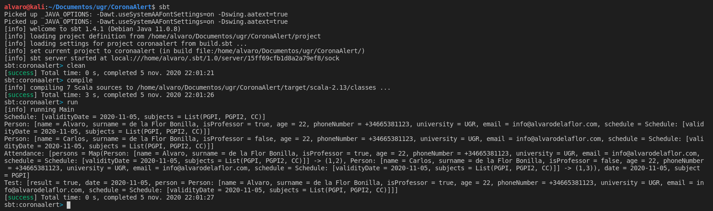

# **Main Classes**

## **Description of the main classes**

All classes have been compiled and tested in a simple [Main.scala](../src/main/scala/Main.scala) and the compilation has also been tested using sbt.

You can see an example in the following screenshot:

The classes used in this project are as follows:

[Schedule](../src/main/scala/Schedule.scala)
- validityDate. Maximum validity date of the created schedule.
- subjects. Set of subjects that make up the student's schedule

Each student will have the possibility to model his or her schedule.

Some of the user stories that model this class are [#US3](https://github.com/alvarodelaflor/CoronaAlert/issues/18), [#US4](https://github.com/alvarodelaflor/CoronaAlert/issues/19) and [#US5](https://github.com/alvarodelaflor/CoronaAlert/issues/20).

[Person](../src/main/scala/Person.scala)
- Name
- isProfessor (Boolean)
- Surname
- Age
- Phone Number
- University
- Email
- Schedule

Each user profile is modelled by this class.

One of the user stories modelling this class is [#US1](https://github.com/alvarodelaflor/CoronaAlert/issues/16).

[Attendance](../src/main/scala/Attendance.scala)
- List[Map[Person -> (Int, Int)]]. Person who record attendance.
- Date. Date on which attendance was provided.
- List(subjects). Subjects' ID list. 

Each time a user attends a class, they must record their attendance, which will be modelled by this class.

One of the user stories modelling this class is [#US2](https://github.com/alvarodelaflor/CoronaAlert/issues/17)

[Test](../src/main/scala/Test.scala)
- Result. The result can only be of two types, positive or negative.
- Date. Date one week before symptoms.
- Person. Who records the tests.

The aim of this class is to model the results after the laboratory tests carried out by the user.

Some of the user stories that model this class are [#US6](https://github.com/alvarodelaflor/CoronaAlert/issues/21).

[ContactController](../src/main/scala/ContactController.scala)

 - This class will be responsible for carrying out the business logic required for attendance management and contact counting [#US7](https://github.com/alvarodelaflor/CoronaAlert/issues/23).

[NotificationController](../src/main/scala/NotificationController.scala)

- As for this class, it will serve to manage the user notification service [#US8](https://github.com/alvarodelaflor/CoronaAlert/issues/24).