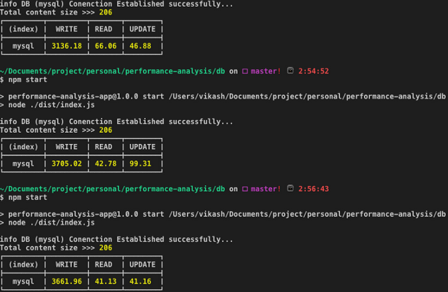
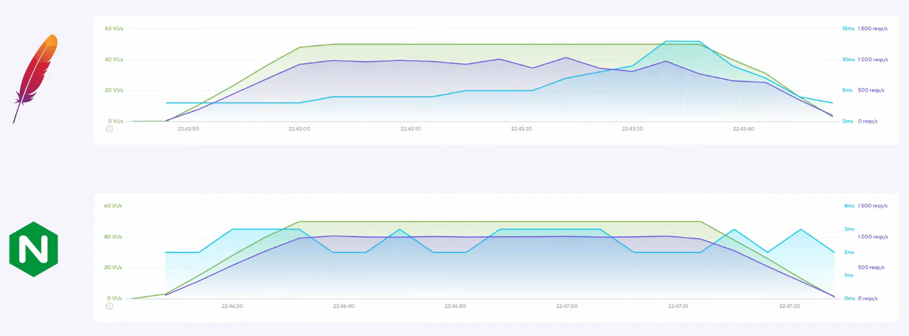

# Documentation and justification of the cluster structure

In this section we will analyze what and which are the required elements of our application.

Our first service would be the API, which is driven as we saw before by the *Play* framework. For this we will take advantage of the fact that we have this part of the application already dockerized as you can see in this [link](../Dockerfile).

What else do we need? Another of the main blocks that should compose our cluster would be the data storage. So far we have not used any element for our application to have a real structure for data persistence, so at this point we will have to decide which tool we are going to use.

Specifically for this project we have decided to work with relational models. With a view to a future extension of this project, it has been decided to use *Postgres* as a starting point as database technology.

There are two reasons that justify this choice:

Firstly (also thinking in a future plan) Heroku is going to be used as a deployment platform since it enables a free plan for students with which I have been working for several years. Specifically, it allows to use a machine with 512 MB of RAM and 10 simultaneous processes always active (the free plan goes to sleep if not used). For more information see this [link](https://www.heroku.com/pricing).

Among all the databases available in *Heroku*, for free only three of them allow us to communicate natively with the *Heroku* CLI, which from my own experience I recommend its use.

1. Heroku Postgres
2. Heroku Redis
3. Apache Kafka on Heroku

As we have started this block, we have decided to use a relational. On the other hand, although we would lose the compatibility with Heroku CLI we could also add the *addon* *JawsDB MySQL* and use the *MySQL* technology instead of *Postgres*. Which one to choose then?

To make this comparison we have entered this curious [repository](https://github.com/VikashChoudahry/db-performance-benchmarking) in which a benchmarking between both technologies is made. The objective is summarized in the calculation of the performance performed in reading, writing and updating a table.

As we can see, the analysis has been repeated three times with a JSON with an approximate weight of 14 MB, and on average, the results were as follows:

1. Read: 31.65 ms
2. Write: 2279.25 ms
3. Update: 26.26 ms

As for the performance of *MySQL* as we can see in previous image, repeating the same parameters as in the case of *Postgres*, have been:

1. Read: 49.99 ms
2. Write: 3501.05 ms
3. Update: 62.45 ms

What conclusion do we obtain therefore? That *Postgres* is:
1. **57.95% faster reading data**.
2. **53.61% faster writing data**
3. **137.81% faster updating data**

Therefore, after the comparison, we have decided to use **Postgres**.

Once we have decided that we are going to use *Postgres* the next task is to choose a container for use in this project. In this particular case, *Postgres* has an official version in *Docker Hub*. For now we will use the latest version available and in the performance section we will vary it to compare results.

The next major structure we will have to add will be the API Gateway. For our project we have decided to use *Nginx* which is part of the options recommended by *Play Framework*, our microservices framework (you can see the guide in this [link](https://www.playframework.com/documentation/2.8.x/HTTPServer)).

Among the alternatives we have decided to choose *Nginx* because, focusing on the speed of response, it is faster and allows more concurrent connections than its competitors using less resources.

What matters most to us in this comparison, beyond the page load time, is the average response time per second. Keep in mind that our system is intended to be used by a multitude of students at the same time, so a fast and agile response from the server is expected. For example, for a test involving 50 concurrent users for 60 seconds, *Nginx* averaged **739 requests per second** with an average response time of **2.52 seconds**, while *Apache*, its main alternative, averaged **575 requests per second** in **5. 26 ms** on average, i.e., on this occasion *Apache* is **23% lower** in terms of responses per second and takes **twice as long to provide the answer** (comparison used using K6, more information in this [link](https://k6.io/)).

Extending this test further, for 500 concurrent users and 10 000 requests, *Nginx* averaged **6205 requests per second** with an average response time of 80 ms, while *Apache* averaged **3531 requests per second** with an average response time of 141 ms. In this case *Nginx* is able to answer **43% more requests per second** in **76% less time**.

Therefore, due to the better performance of *Nginx*, especially under heavy load pressure, we have decided to choose it.

As a summary of everything we have seen so far we can say that the structure of our cluster will basically consist of three large blocks:

1. Our previously Dockerized application.
2. Postgres as database.
3. Deploying NGINX as an API Gateway.