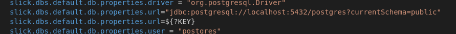

# Composition file documentation

The purpose of this section is to explain how the different containers are interrelated. The base file on which the explanation will be based:

    version: '2'

    networks:
    app-tier:
        driver: bridge

    services:

    postgresql:
        image: 'bitnami/postgresql:latest'
        networks:
        - app-tier
        environment:
        - POSTGRESQL_USERNAME=postgres
        - POSTGRESQL_PASSWORD=postgres

    nginx:
        build: ./nginx
        ports:
        - '80:8080'
        networks: 
        - app-tier
        depends_on: 
        - play

    play:
        build: .
        environment:
        - KEY=jdbc:postgresql://postgresql:5432/postgres?currentSchema=public
        ports:
        - "9000:9000"
        volumes:
        - /root
        networks:
        - app-tier

The first thing we have done is to create a network (*app-tier*), this network will be used to establish the linking between the different containers.

To add this network to our container, we will simply have to do, inside each service:

        networks:
        - app-tier

In addition, for the case of Postgres it has been necessary to add in our case an environment variable for the deployment by means of docker-compose. The problem arises because when using the interconnection of containers we cannot resort to *Postgres* through the *localhost* address but we will have to use the name that we have given to the container in the file [docker-compose.yml](../docker-compose.yml). To solve this, all we have to do is to set a default value for this variable (for the cases of e.g. deployment without using the compose file). In addition we set just below the possibility of using an environment variable that will be used by the composition file.

To use it, we go to the *Play Framework* service and add:

    environment:
      - KEY=jdbc:postgresql://postgresql:5432/postgres?currentSchema=public

As we can see the value of *localhost* is substituted *postgresql* if we finally use the composition file.

The next step will consist of configuring *Nginx*. The first difference with the previous case is that we will not use the image directly, but we will link it to our composition file via another Dockerfile, namely [this one](./../nginx/Dockerfile).

    FROM bitnami/nginx:1.19-debian-10

    COPY my_server_block.conf /opt/bitnami/nginx/conf/server_blocks/

First of all, we use the Bitnami image instead of the original one because of the problem explained in the previous section.

On the other hand, we need this intermediate file in order to tell the container to copy the configuration we have done externally [here](../nginx/my_server_block.conf).

    server {
        listen 0.0.0.0.0:8080;
        location / {
            proxy_set_header X-Real-IP $remote_addr;
            proxy_set_header HOST $http_host;
            proxy_pass http://play:9000;
            proxy_redirect off;
        }
    }

Basically what we are doing is setting up a Reverse Proxy, in which *Nginx* will capture all requests, send them to our microservices framework and capture once again the response from it.

As in the previous case, we are also going to add this container to the network that we created previously, and to do so:

    networks: 
    - app-tier

Finally, we will have to express the dependency of *Nginx* with the *play* service and for this we will have to add:

    depends_on: 
    - play

Finally there is only the *play* service where we add our previously dockerized application in the [Dockerfile](../Dockerfile) file.

As in previous cases, we will have to add the connection to the created network:

    networks:
    - app-tier
