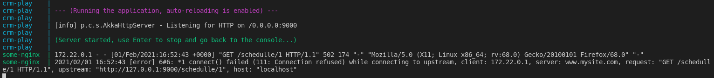
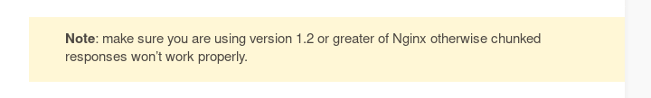

# Documentation and justification of the configuration of each of the containers that compose it

In the previous section ([link](cluster_structure.md) to see it) we justified the choice of the containers chosen to build our cluster. In this section we will detail and explain the configuration that we will have to perform in each one of them.

We will start with **Postgres**.

*What do we need to configure in our database?*

To make this configuration and try to follow a script of good practices we are going to attend to the official documentation of *Postgres-Docker* that you can find in this [link](https://hub.docker.com/_/postgres).

First of all we must choose the version of our image, in our case we will use the *9.6.20-alpine* that so far seems the most recent image less heavy.

    image: postgres:9.6.20-alpine

 First we will have to configure the login credentials. To do this, simply in our [docker-compose](../docker-compose.yml) file we will have to indicate it, to do so, we will go into more detail later (see [composition file documentation](composition_file.md)).

 As indicated in the link we indicated above we will do something similar to the following (inside the configuration of this container in our docker-compose file):

     environment:
      POSTGRES_USER: postgres
      POSTGRES_PASSWORD: postgres

So far we have solved the authentication. The next step will be to configure access to our project database. As indicated [here](https://hub.docker.com/_/postgres), you can use the *POSTGRES_DB* variable to define a different name for the default database that is created when the image is first started. If not specified, the value of POSTGRES_USER will be used. In our case we will modify this value so:

    environment:
    - POSTGRES_DB=coronaalert
    - POSTGRES_USER=postgres
    - POSTGRES_PASSWORD=postgres

The next step, is to persist the data in a dockerized postgres database using volumes.

    volumes:
    - ./postgres-data:/var/lib/postgresql/data

And finally, we will have to map the port. By default *Postgres* uses 5432, we will leave this one.

    ports:
      - 5432:5432

After making the following configurations of *Nginx* and *Play Framework* as we will see later we decided to change the version used by the latest available Bitnami. The reason is that in numerous occasions there were incompatibilities when using the three containers at the same time.

Specifically, the error that occurred when using version from version 9.6 to 13 of *Postgres* was this one:

    Caused by: org.postgresql.util.PSQLException: Connection to medmap-db:5433 refused. Check that the hostname and port are correct and that the postmaster is accepting TCP/IP connections

By simply changing to the image: bitnami/postgresql:latest the problem was solved.

We continue with the configuration of the **Nginx** server.

Once again, we will use the official image of *Nginx* in *Docker Hub*, specifically we will use the [latest](https://hub.docker.com/layers/nginx/library/nginx/latest/images/sha256-a92e3a59132cf7731f39e1feeaf95195ca95e5845f5c97eed259ae2b99e104f2?context=explore) version. The official documentation can be found at this [link](https://hub.docker.com/_/nginx).

Regarding *Nginx* this time we will simply map the ports.

    ports:
    - 80:8080

After first checking the image above we discovered that it was incompatible with our system configuration, we tested versions from 1.16 to 1.19 and all of them had the same error.

After some research we discovered an image of *Nginx* developed by [Bitnami](https://bitnami.com/), (specifically [this one](https://hub.docker.com/r/bitnami/nginx)) that solved the above problem. Perhaps, the error is caused (as you can see in the following image) by the fact that *Play Framework* recommends using at least version 1.2 of *Nginx*, while the latest version available in Docker Hub is 1.9.

As will be discussed later in the section where we detail the connection between the different containers, for the case of *Nginx* it is necessary to perform an additional configuration, so instead of indicating the image directly in our file [docker-compose](../docker-compose.yml) we will build the image from a separate file [Dockerfile](../nginx/Dockerfile) in which we will also copy the necessary files to make the connection between *Play Framework* and *Nginx*. In the following block we will explain it better (or you can see it already clicking in this [link](composition_file.md)). For this we will only have to do:

    build: ./nginx

And finally, let's configure the application we have developed using the image built earlier, **[Coronaalert](https://hub.docker.com/r/alvarodelaflor/coronaalert)**.

Once again, we will have to map the ports, which is done in exactly the same way as in the previous occasions:

    ports:
    - 9000:9000

In the next section, [composition file documentation](composition_file.md) we will explain how to associate this container with the others.