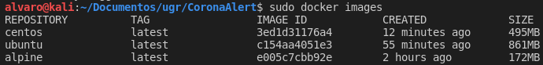
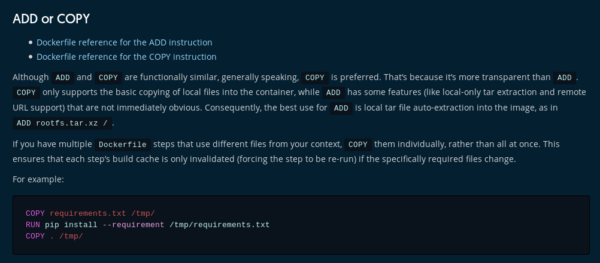
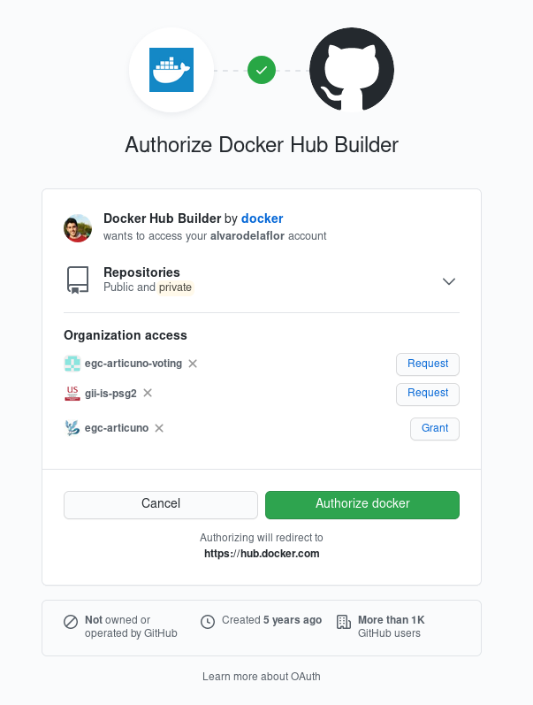
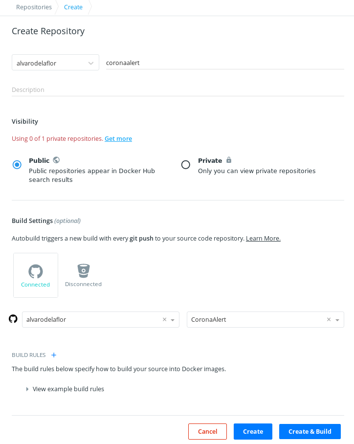
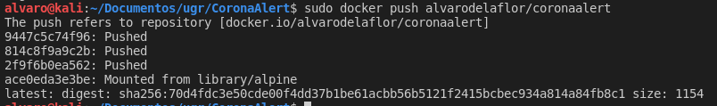
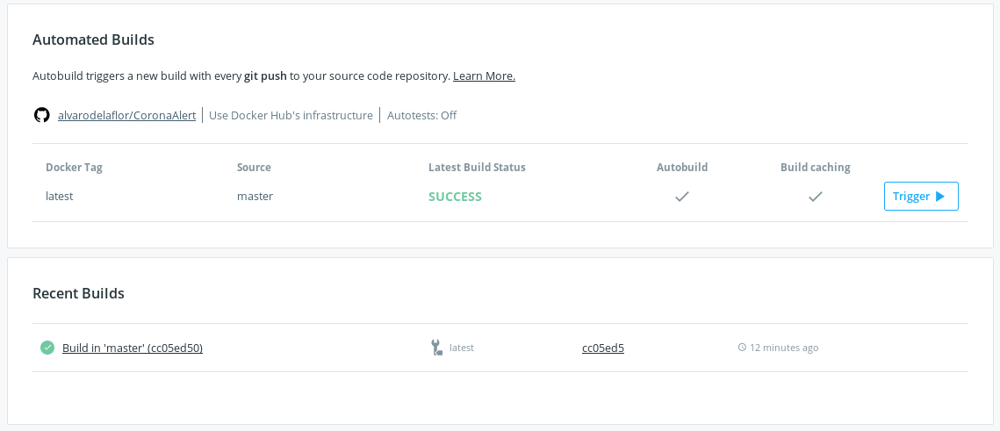

# **Base container** :whale2:

## **Introducción**

The main objective of this section is to locate and select the best possible container for our application. In order to do so, you will have to take into account some minimum requirements:

1. Occupy the smallest possible size
2. Fulfilling the required requirements
   1. JDK
   2. Scala Language
   3. SBT
   4. Mmake

Taking into account the above requirements, the options shown below were considered.

## **Options**

There are many possibilities to choose a base image for our project since the vast majority of distributions have a Docker image. The objective of this document is to test the different options available (having preferences for the most common ones since we have very little experience in handling this tool).

The size of the final image built after installing all the tools and dependencies indicated above will be the differentiating factor that will decide the choice of the image that will finally be used.

Three distributions have been tested and compared.

### **Alpine**

The *Dockerfile* that has been used for this distribution can be found in this [link](Dockerfiles/alpine/Dockerfile). We will comment on the main features of the file that has been built in the form of comments within the file itself:

---

    # The latest available version of 'Alpine' has been chosen
    FROM alpine:latest

    ARG SBT_VERSION=1.4.1
    ENV SBT_HOME=/usr/local/sbt
    VOLUME /app/test /app/app

    LABEL maintainer ="Alvaro de la Flor Bonilla <alvdebon@correo.ugr.es>" \
            com.coronaalert.version="3.0.0" \
            com.coronaalert.release-date="2020-11-27" \
            com.coronaalert.repository="https://github.com/alvarodelaflor/CoronaAlert"
        
    # In the following lines is made:
    # Group creation
    # User creation
    # Permissions are applied to the user
    # Installation of bash curl and creation of SBT container folder
    # Download SBT and install SBT
    # Download mmake and install
    # Uninstallation of curl

    RUN addgroup -S coronaalert && \
        adduser -S usuario -G coronaalert -s /bin/ash && \
        chown -R usuario /app && \
        apk add --no-cache openjdk8 curl bash && mkdir $SBT_HOME && \
        curl -sL https://github.com/sbt/sbt/releases/download/v$SBT_VERSION/sbt-$SBT_VERSION.tgz | \
        tar -xz --strip-components=1 -C $SBT_HOME && ln -s $SBT_HOME/bin/sbt /usr/bin/ && \
        sh -c "$(curl -sf https://gobinaries.com/tj/mmake/cmd/mmake)" && \
        apk del curl

    # Change to the new working directory
    WORKDIR /app/test

    # We change a user without privileges
    USER usuario

    # We copy the necessary files
    COPY build.sbt Makefile.

    # We launch the tests
    CMD ["sbt", "test"]
---

Once the construction of the Dockerfile is finished (following the best practices script to reduce the size), we build the image and obtain a final weight of **172MB**. Later in the comparison we will deepen in this section.

### **Ubuntu**

The *Dockerfile* that has been used for this distribution can be found in this [link](Dockerfiles/ubuntu/Dockerfile). In this case, due to the similarity with the previous case, only the differences will be commented:

1. Ubuntu requires a previous configuration of the time zone, so the following configuration variable has been added

    > ENV TZ=Europe

    And a symbolic link has been created:

    > ln -snf /usr/share/zoneinfo/$TZ /etc/localtime && echo $TZ > /etc/timezone

2. For the installation of SBT has been necessary to add in this case additional dependencies such as gnupg2 and a new repository.

---
    FROM ubuntu:latest

    ENV TZ=Europe

    VOLUME /app/test /app/app

    LABEL maintainer ="Alvaro de la Flor Bonilla <alvdebon@correo.ugr.es>" \
            com.coronaalert.version="3.0.0" \
            com.coronaalert.release-date="2020-11-27" \
            com.coronaalert.repository="https://github.com/alvarodelaflor/CoronaAlert"

    RUN ln -snf /usr/share/zoneinfo/$TZ /etc/localtime && echo $TZ > /etc/timezone && \
        useradd -m usuario && \
        chown -R usuario /app && \
        apt-get update && apt-get install curl gnupg2 -y && \
        echo "deb https://dl.bintray.com/sbt/debian /" | tee -a /etc/apt/sources.list.d/sbt.list && \
        curl -sL "https://keyserver.ubuntu.com/pks/lookup?op=get&search=0x2EE0EA64E40A89B84B2DF73499E82A75642AC823" | apt-key add && \
        apt-get update && \
        apt-get install -y sbt openjdk-11-jdk && \
        sh -c "$(curl -sf https://gobinaries.com/tj/mmake/cmd/mmake)" && \
        apt-get remove -y curl gnupg

    WORKDIR /app/test

    USER usuario

    COPY build.sbt .
    COPY Makefile .

    WORKDIR /app

    CMD ["sbt", "test"]
---

On this occasion, after building the image we can see that the final result is a size of **861MB**.

### **CentOS**

The *Dockerfile* that has been used for this distribution can be found in this [link](Dockerfiles/CentOS/Dockerfile). In this case, due to the similarity with the previous case, only the differences will be commented:

    FROM centos:latest

    ARG SBT_VERSION=1.4.1
    ENV SBT_HOME=/usr/local/sbt
    ENV JAVA_HOME /usr/lib/jvm/java-1.8.0-openjdk/
    VOLUME /app/test /app/app

    LABEL maintainer ="Alvaro de la Flor Bonilla <alvdebon@correo.ugr.es>" \
            com.coronaalert.version="3.0.0" \
            com.coronaalert.release-date="2020-11-27" \
            com.coronaalert.repository="https://github.com/alvarodelaflor/CoronaAlert"

    RUN adduser usuario -s /bin/ash && \
        chown -R usuario /app && \
        yum install -y \
        java-1.8.0-openjdk \
        java-1.8.0-openjdk-devel \
        wget \
        curl && \
        wget http://dl.bintray.com/sbt/rpm/sbt-${SBT_VERSION}.rpm && \
        yum install -y sbt-${SBT_VERSION}.rpm && \
        sh -c "$(curl -sf https://gobinaries.com/tj/mmake/cmd/mmake)"

    WORKDIR /app/test

    USER usuario

    COPY build.sbt .
    COPY Makefile .

    WORKDIR /app

    CMD ["sbt", "test"]

There are no notable differences with respect to the construction of the image of the previous case. The constructed image has a weight of **495MB**.

## **Comparison and choice**

As we expressed at the beginning of this document, we started the comparison with three distributions widely used today:
   
1. Alpine
2. Ubuntu
3. CentOs

After installing in all of them the same dependencies and requirements, we obtained the following results:

As you can see, despite installing exactly the same in all of them the difference in size between the images is very large, establishing itself as a clear winner *Alpine*.

Any image used could have been valid, however, because the project that was developed does not present any great restriction at the level of requirements of the image container, a cryptology has been established based only on the final size.

## **Best Practices**

1. **Use of COPY instead of ADD**. As recommended in the official docker website, specifically in this [post](https://docs.docker.com/develop/develop-images/dockerfile_best-practices/), whenever possible, **COPY** will be the best option.

2. Continuing with the previous point, only the necessary has been copied.

3. **Run unification**. The use of the **RUN** instruction has been unified to the maximum, aiming at reducing the number of layers in the container.

4. We have tried to install the minimum number of rooms, only those necessary for the development of the project, thus reducing the size of the image.

5. Unused files and dependencies have been removed, for example, after the installation of some other one.

## **Docker Hub**

Once we have the final image, we will give it persistence in the cloud using Docker Hub.

First we will need to link our GitHub account to an account on Docker Hub:

Then we have to create a repository in Docker Hub and associate it with our GitHub repository.

Finally we only have to push our Docker Hub repository:

A final important step is to automate the builds for each push on the main GitHub repository.

***

## **GitHub Container Registry**

As an alternative registry, we decided to use the GitHub Container Registry and followed the official tutorial available at this [link](https://docs.github.com/es/free-pro-team@latest/packages/using-github-packages-with-your-projects-ecosystem/configuring-docker-for-use-with-github-packages).

As a summary of the steps to perform have been:

1. Create a token that allows access to GitHub packages and add it to the Docker.
2. Locate the image and push it to GitHub.

You can check for these containers at this [link](https://github.com/alvarodelaflor?tab=packages&repo_name=CoronaAlert).

***