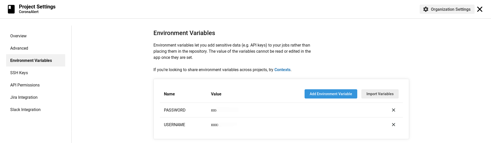
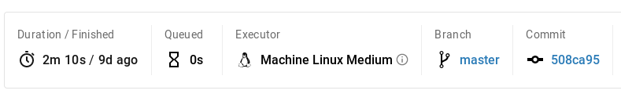
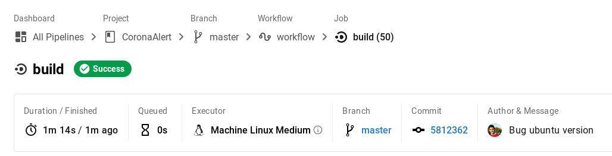
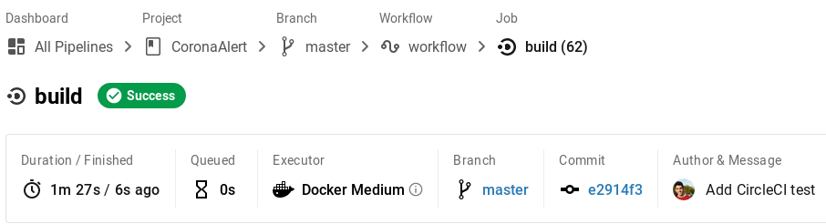

### **Use of the Docker container in the CI**

As we have mentioned in previous points, we will use our alternative CI to work with the Docker container we have built. To do this, we will have to work its configuration file which is available in this [link](../.circleci/config.yml).

The first version of our configuration was this one:

    version: 1
    jobs:
        build:
            machine: true
            steps:
                - checkout
                - run: |
                    echo "$PASSWORD" | docker login --username $USERNAME --password-stdin
                    docker run -t -v `pwd`:/app/test alvarodelaflor/coronaalert sh -c "ls && make test"

First of all, as indicated in the *CircleCI* good practice guide for the login tasks we have used the system configuration variables as indicated in this [link](https://circleci.com/docs/2.0/private-images/) for both the username and the password.

It is very simple, we will only have to go to the configuration of our project in the web of *CircleCI* and there is a section specifically designed for it as you can see in the image above.

The other value that we analyze is *"machine: true "*. It indicates the type of machine to be executed being *true* the default value. However, as indicated [here](https://circleci.com/docs/2.0/docker-compose/) its use may require costs in future updates, so we set out to study the difference in performance between using it and not.

The first image above corresponds to the construction of the build using the default value *true*.

Our next test consisted of modifying the default value and using an ubuntu configuration setting instead:

    machine:
      image: ubuntu-2004:202010-01

The result is a build that finishes twice as fast, almost one minute less. But is it really worth using this variable? As indicated in the documentation, charges may be applied in the future and it certainly means that this is very likely to happen.

To not use the *machine* variable we have to completely reconfigure the *CircleCI* configuration file as follows:

    version: 2
    jobs:
    build:
    docker:
        - image: alvarodelaflor/coronaalert
        auth:
            username: $USERNAME
            password: $PASSWORD
    steps:
        - checkout
        - setup_remote_docker:
            version: 19.03.13      
        - run: |
            sh -c "ls && make test"

As a difference to the previous case we can see that in this case the authentication is performed after invoking our docker container, once again using the environment variables that allows us to add *CircleCI*.

The next step different from previous configurations, as indicated in this [link](https://circleci.com/docs/2.0/building-docker-images/) is to configure the version of the main executor. We have decided to use the latest version available to check how it performs in our case (19.03.13).

The last step consists of invoking our task manager, which as it is already part of our container we will simply have to use the call that we have configured without the need to install *Make* in *Circle*.

As you can see in the image above the performance is very similar to the previous case, just a few seconds more, but with the advantage that in this case we do not use the *machine* variable.

Finally we have chosen for our project this last configuration because, although it is possible to improve some seconds using Ubuntu in the *machine* variable, there is a great possibility of adding costs for its use in the future being the difference between both options practically marginal.

