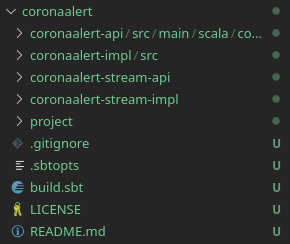

# **Microservice**

From the base that has been built, it is intended to build an API REST consisting of a series of routes and test it.

As a starting point for the development of this section we must take into account that the project we are developing uses *Scale* as its main language, so we will have to take it as a restriction when making our choice.

Based on the previous paragraph, how can we build the route service? What libraries or frameworks are available that are compatible with *Scala*? When we focus our searches in a framework to build an API REST we mainly find three solutions: *AKKA HTTP*, *PLAY* and *LAGOM*.

We decided that to choose one or another tool the best way to test the differences is to make real use of all the proposals. Therefore, for each one we will try to carry out a small project, see what they offer and choose according to the requirements of our application.

1. **AKKA HTTP**

As a starting point we could use *AKKA HTTP*. First of all *AKKA HTTP* is not a framework but rather a set of libraries. It is oriented towards flexibility with integration layers, instead of application cores.

It allows the creation of a client-side API that provides asynchronous support.

The use of *AKKA HTTP* is recommended in the following situations:

- [x] Use of REST/HTTP single and lightweight endpoints.
- [x] HTTP servers where flexibility is more important than simplicity.

2. **PLAY**

In this case, *PLAY* if it is a framework. *PLAY* allows developers to build fast and scalable applications. The most interesting thing is that *PLAY* is built on *AKKA* and *AKKA HTTP* so it brings together everything we have explained in the previous point.

However, *PLAY* focuses on allowing developers to create HTML-based user interfaces, which is a bit far from our initial intention which is to build basically a REST API. In spite of all this *PLAY* allows to create a *API REST* as well as add-ons to include important functions like authorization, database integration... in a much easier way compared to the unique use of the *AKKA* libraries.

The use of *AKKA HTTP* is recommended in the following situations:

- [x] Web-based User Interfaces (GUI)
- [x] REST-based microservices
- [x] API gateways
- [x] CRUD style applications

1. **LAGOM**

Our objective is to build microservices so that they are isolated, autonomous and with little communications between them and this is the main intention of *LAGOM*, to facilitate the synchronous or asynchronous communication through HTTP or WebSocket.

In addition, another critical part when developing applications based on microservices is the weak coupling, so it is very important transparency in the way services communicate with each other and with external customers. Lagom integrates a service locator that allows services to be discovered and communicated with each other.

As a representation using the image above, *LAGOM* allows services to communicate with each other using standard APIs and protocols (HTTP and WebSockets). 

However, in cases where communication with external elements is required, a gateway service is used. As expressed in its official documentation (from which the above image has been obtained) the entire system should be understood as a mediaeval city surrounded by a wall to the outside and a single door that is the only way in or out.

Communication within the wall is direct, but communication to or from the outside must be through this door.

First of all, we must add *LAGOM* to our project, for this we have followed the official guide which you can find in this [link](https://www.lagomframework.com/documentation/1.6.x/scala/IntroGetStarted.html).

As indicated, the first step is that we must do is create the project in our directory, for them:

> sbt new lagom/lagom-scala.g8

Once done, after putting some basic data that are requested on the command line for the template, we should have a structure similar to the following.

To run lagom:

        cd coronaalert
        sbt
        ... (booting up)
        > runAll

Once this is done we will have our first initial version, accessible from the url 

        http://localhost:9000/api/hello/World

When we started working with Lagom we found a big problem and that is that, because it is focused on RPC style backend Microservices and CQRS/ES persistence strategies its development is much more complicated by trying to incorporate functionalities to our project that are not necessary. Even so, so far it seems the best candidate. We will now test the second alternative ("Play Framework") to see if it meets our requirements.

To install it, as in the previous case we have to execute the following command:

> sbt new playframework/play-scala-seed.g8

We write our template configuration and ready, we can work with *PLAY FRAMEWORK*.

Then, we go to the folder created and run *PLAY FRAMEWORK* with (we will have to wait for all the packages to be installed):

> sbt run

Once ready, at *http://localhost:9000* we will find the service.

*PLAY FRAMEWORK* works mainly with two files, [routes](../coronaalert/conf/routes) that allows to build the different routes that configure our API and [HomeController](../coronaalert/app/controllers/HomeController.scala) that basically will be in charge of performing the actions requested by the API.

In my opinion, this development scheme fits much better with our project. In fact, *LAGOM* internally implements *PLAY FRAMEWORK* so it is in essence a derived framework.

We are not going to check *AKKA HTML* because they are only a set of libraries that allow us to build a low level API REST, *PLAY FRAMEWORK* shortens all this work.

Another thing we liked about *PLAY FRAMEWORK* is that it follows an MVC architecture. It's true that for the moment, our application doesn't plan to end up using any type of *FRONTEND*, however, the way it allows to separate controllers (responses to events, generally actions performed by the user) and models (information representation, information containers) is perfectly adapted to the type of development we want to follow. In addition, it will facilitate the development of a future version in which user views are incorporated into our application. *LAGOM* on the other hand is much more diffuse, perhaps because its focus and destination is a little different, as we commented before is more focused on a RPC style.

Lagom is Play. It’s built on top of Play. So the question is not much about the performance difference between the two, but for what you need it.

For our project, we have finally chosen to use *PLAY FRAMEWORK*. An initial version of the routes that will be necessary has been made available in this [link](../coronaalert/conf/routes). Currently it works, but it returns a model result as you can see in this [link](../coronaalert/app/controllers/HomeController.scala).

***