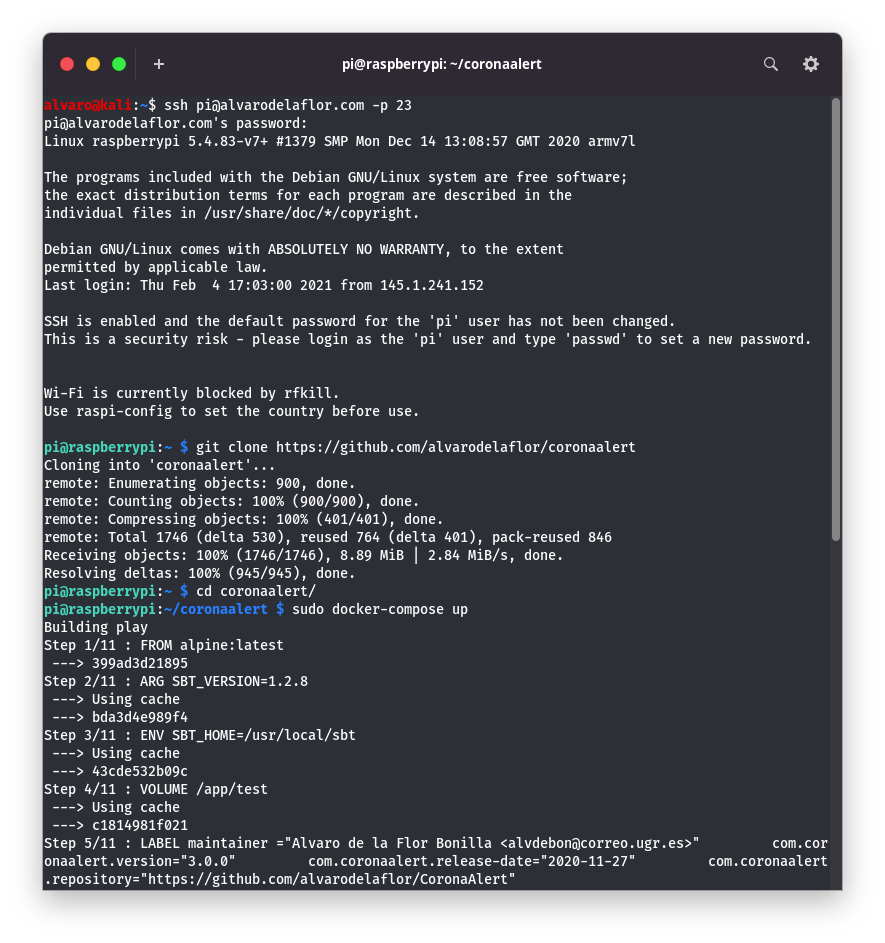
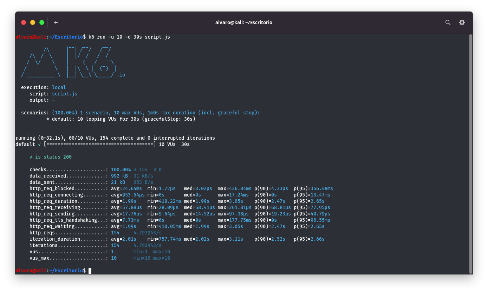
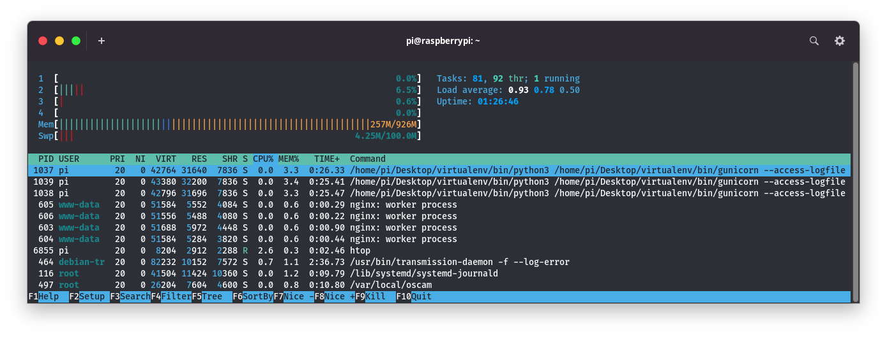
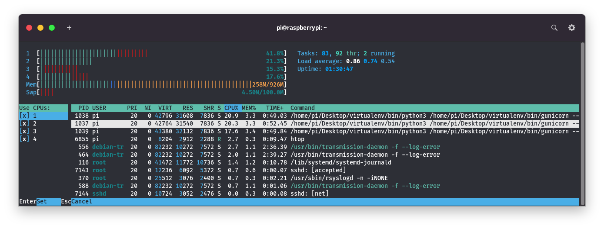
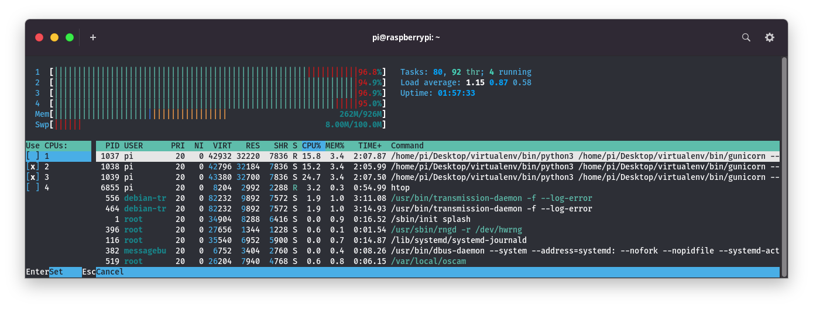
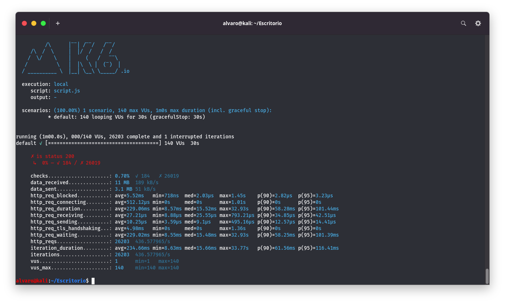

# Speed testing, project completion, deployment to a cloud service

To test the performance of our system we decided to use our own rasberry, under the raspbian system. Therefore the steps for the installation of our project have been reduced to install docker and docker-compose on it and run our composition file.

To test our system, as we did for the choice of *Nginx* we will use the [*K6*](https://k6.io/) tool.

Its use is very simple, after installing it in our system, we will have to build a script like the following one:
                                                                        
    import { check } from "k6";
    import http from "k6/http";

    export default function() {
        let res = http.get("<OUR ADDRESS TO CHECK>");
        check(res, {
            "is status 200": (r) => r.status === 200
        });
    };

What are we going to do? Well, in the previous script we are going to introduce all the possible URLs of our system (*GET*, *POST* and *DELETE* requests will be included). Therefore, the routine that we have made, for each user, will perform all possible requests that our project allows.

Basically it is constituted in the same way as in the tests we have performed in previous cases, we set an address and then the result we expect.

To run it we will use the following command:

> k6 run -u X -d Ys Z

Where X is the number of virtual users to be used, Y is the number of seconds our test will run and Z sets the configuration file we discussed earlier.

First, we will start with a simple test, asking the system for the time registration of all the students, we will use in this first test 10 users for 30 seconds:

> k6 run -u 10 -d 30s script.js

In this first test we can see that finally it has had a duration of 32.1 seconds in which 154 requests have been made, which corresponds to about 4.8 requests per second.

In the following images we will first see the state of our system at rest compared to the moment of more requests. The average response time has been 2 seconds per request.

As we can see, the CPU usage grows considerably, as is logical, but no CPU unit exceeds 50% of its capacity at any time. On the other hand the memory usage remains unchanged.

The next step will be to try to find the maximum point of our server and having so few resources as in our case (Raspberry Pi 3) we do not expect it to be complicated.

The image above corresponds to the moment of maximum demand established by 150 virtual users in a 30 seconds test, in which as you can see, the server has reached the maximum of its capacity in terms of CPU resources.

As for the CPU performance itself, as you can see in the image above, of the 2603 requests made, only 184 of them have had a correct answer, that is, only 0.70% of the requests made.