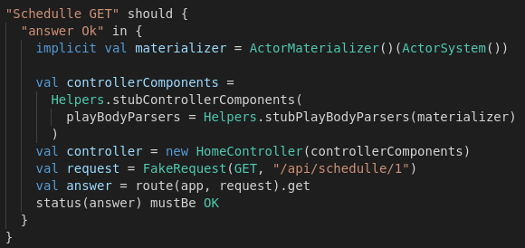

# **Tests**

The *Play Framework* allows us to use a wide variety of test types, in fact, *PLAY* allows us to continue to perform our tests as before, with the use of the *ScalaTest* library. We will simply have to add your particular library, to do so:

        libraryDependencies ++= Seq(
        "org.scalatestplus.play" %% "scalatestplus-play" % "3.0.0" % "test
        )

They follow exactly the same dynamic that was explained in the respective section of *Scalatest* available in this [link](https://github.com/alvarodelaflor/CoronaAlert/blob/master/Documentation/tools.md#test-framework-used). An example of a test using the API could be the following:

        "Application" should {
                "be reachable" in new WithServer {
                        val response = await(WS.url("http://localhost:" + port).get()) //1
                        response.status must equalTo(OK) //2
                        response.body must contain("Semaphore Community Library") //3
                }
        }

The functionality of the API has been tested and is available at this [link](../coronaalert/test/controllers/HomeControllerSpec.scala).

In the image above you can see an example of a test on a GET route.

Once again we remind you that to run all the tests that have been made (not just checking the routes) you only have to run:

> mmake test

***