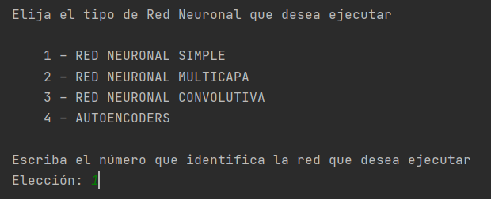
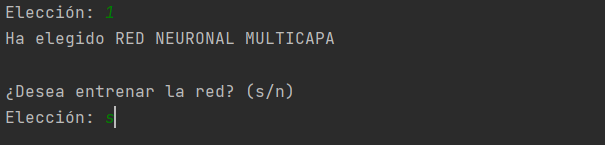
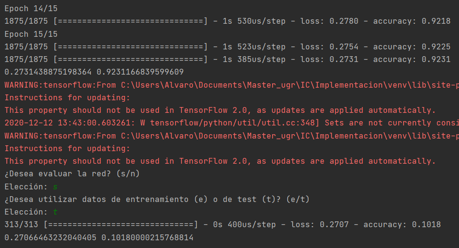
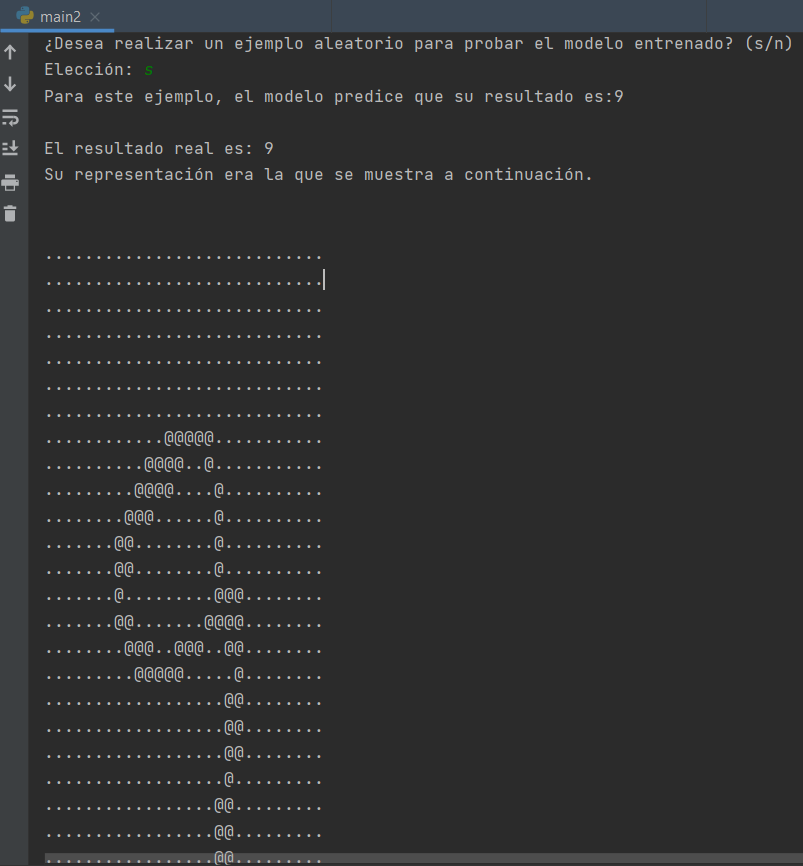

# **Reconocimiento óptico de caracteres MNIST**

## **Introducción**

Este repositorio se ha creado para la realización de la práctica final de la asignatura *[Inteligencia Computacional](http://decsai.ugr.es/index.php?p=asignaturas&action=info&id=100403)* la cual forma parte del *[Máster Oficial de Ingeniería Informática](https://masteres.ugr.es/ing-informatica/)* de la *[Universidad de Granada](https://www.ugr.es/)*.

El objetivo de esta práctica es resolver un problema de reconocimiento de patrones utilizando redes neuronales artificiales. Para ello se ha evaluado el uso de varios tipos de redes neuronales para resolver un problema de OCR: el reconocimiento de dígitos manuscritos de la base de datos MNIST (http://yann.lecun.com/exdb/mnist/).

Puede visitar parte del temario que se ha utilizado para la realización de esta práctica en este [enlace](https://elvex.ugr.es/decsai/deep-learning/).

## **Implementación**

Para la solución del enunciado de la práctica se ha optado por el uso de la librería [Keras](https://keras.io/), una biblioteca de Redes Neuronales de Código Abierto escrita en Python. Es capaz de ejecutarse sobre TensorFlow, Microsoft Cognitive Toolkit o Theano. Está especialmente diseñada para posibilitar la experimentación en más o menos poco tiempo con redes de Aprendizaje Profundo. Sus fuertes se centran en ser amigable para el usuario, modular y extensible. 

Para el desarrollo de esta práctica se ha optado por la realización. En concreto se han realizado 4 implentaciones:

1. RED NEURONAL SIMPLE
2. RED NEURONAL MULTICAPA
3. RED NEURONAL CONVOLUTIVA
4. AUTOENCODERS

En la memoria de esta práctica disponible en la sección de documentación se ha realizado una explicación detallada de que se ha hecho en cada una de ellas.

## **¿Cómo usarlo?**

En primer lugar simplemente deberá descargar el repositorio.

> git clone https://github.com/alvarodelaflor/ic.git

Una vez descargado deberemos ejecutar el archivo [main.py](Implementacion/main.py) teniendo en cuenta que deberemos tener activo un entorno virtual con todas las dependencias indicadas en el archivo [requirements.txt](Implementacion/requirements.txt)

Una vez satisfechas todas las dependencias tan solo deberemos ejecutar el archivo [main.py](Implementacion/main.py)

> python main.py

Ejecutado el archivo, el script nos preguntará que tipo de implementación queremos ejecutar, pudiendo elegir entre cuatro:

Por ejemplo, en este caso para elegir la ejecución de *RED NEURONAL SIMPLE* tendremos que escribir 1.

El siguiente paso es elegir si se desea entrenar la red o no. Por ejemplo en la siguiente imagen se ha decidido si entrenar la red, escribiendo *s*, para cancelar el entrenamiento simplemente deberemos escribir *n*.

Posteriormente comenzará un proceso de entrenamiento con las diferentes iteraciones que finalizará mostrando la evaluación final sobre el conjunto de entrenamiento y la pregunta de si queremos evaluar nuestro modelo final con un conjunto destinado específicamente para ello o de nuevo sobre el conjunto de test.

Finalmente, podemos probar de forma visual el modelo entrenado que hemos realizado, mostrando un número aleatorio y comprobando si la red ha sido capaz de evaluarla bien o no.

