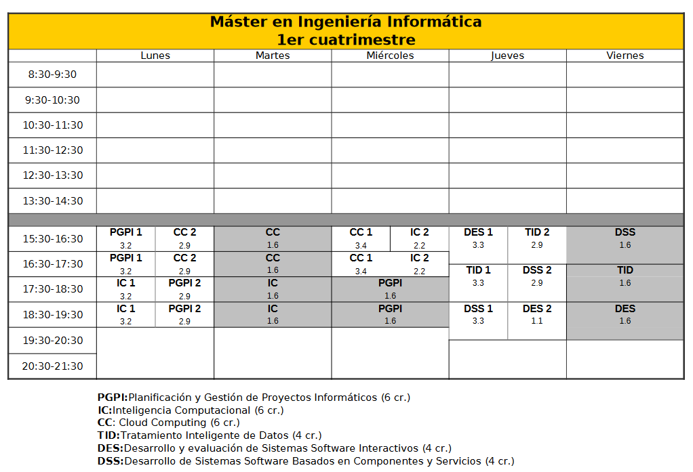
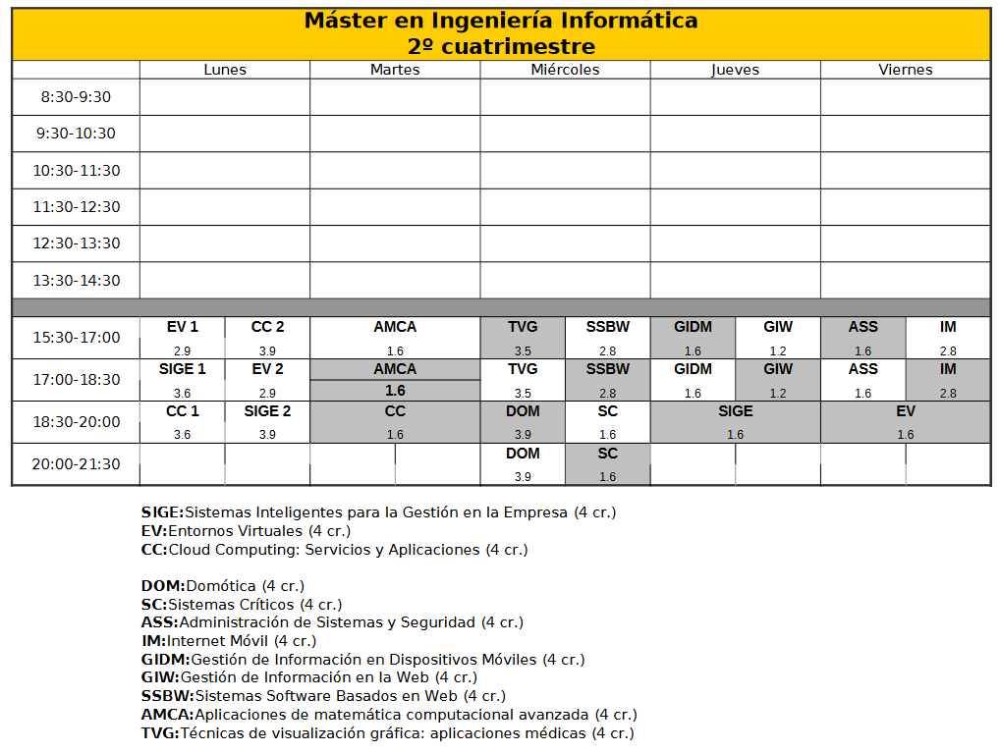

<h1 align="center">Máster Oficial de Ingeniería Informática - Universidad de Granada</h1>

#   

Repositorio personal para el Máster Oficial de Ingeniería Informática de la [Univerdad de Granada](https://www.ugr.es/), curso académico 2020 - 2021.

 El [Máster Profesional en Ingeniería Informática](https://masteres.ugr.es/ing-informatica/) es un título que habilita para el ejercicio de la profesión de Ingeniero Informático según la Resolución de 8 de junio de 2009, de la Secretaría General de Universidades, publicada en BOE Núm. 187 de martes 4 de agosto de 2009.

Da respuesta a la demanda de profesionales con una amplia y sólida formación avanzada en Ingeniería Informática por parte de las empresas del ámbito de las TIC.

Los titulados podrán dirigir y realizar tareas en las diferentes fases de proyectos de desarrollo, de investigación o de innovación en ámbitos relacionados con la informática, incluyendo también los de naturaleza multidisciplinar. 

Asignaturas del primer cuatrimestre impartidas:

1. [**PGPI**:Planificación y Gestión de Proyectos Informáticos (6 cr.)](https://github.com/alvarodelaflor/mii_ugr/tree/main/01_PGPI)
2. [**IC**:Inteligencia Computacional (6 cr.)](https://github.com/alvarodelaflor/mii_ugr/tree/main/01_IC)
3. [**CC**: Cloud Computing (6 cr.)](https://github.com/alvarodelaflor/mii_ugr/tree/main/01_CC)
4. [**TID**:Tratamiento Inteligente de Datos (4 cr.)](https://github.com/alvarodelaflor/mii_ugr/tree/main/01_TID)
5. [**DES**:Desarrollo y evaluación de Sistemas Software Interactivos (4 cr.)](https://github.com/alvarodelaflor/mii_ugr/tree/main/01_DES)
6. [**DSS**:Desarrollo de Sistemas Software Basados en Componentes y Servicios (4 cr.)](https://github.com/alvarodelaflor/mii_ugr/tree/main/01_DSS)

Asignaturas del segundo cuatrimestre impartidas:

1. [**SIGE**:Sistemas Inteligentes para la Gestión en la Empresa (4 cr.)](https://github.com/alvarodelaflor/mii_ugr/tree/main/02_SIGE)
2. [**EV**:Entornos Virtuales (4 cr.)](https://github.com/alvarodelaflor/mii_ugr/tree/main/02_EV)
3. [**CC**:Cloud Computing: Servicios y Aplicaciones (4 cr.)](https://github.com/alvarodelaflor/mii_ugr/tree/main/02_CC2)
4. [**DOM**:Domótica (4 cr.)](https://github.com/alvarodelaflor/mii_ugr/tree/main/02_DOM)
5. [**GIW**:Gestión de Información en la Web (4 cr.)](https://github.com/alvarodelaflor/mii_ugr/tree/main/02_GIW)
6. [**SSBW**:Sistemas Software Basados en Web (4 cr.)](https://github.com/alvarodelaflor/mii_ugr/tree/main/02_SSBW)
7. [**ASS**:Administración de Sistemas y Seguridad (4 cr.)](https://github.com/alvarodelaflor/mii_ugr/tree/main/02_ASS)

*Nota: en algunas asignaturas se ha utilizado un repositorio propio* 